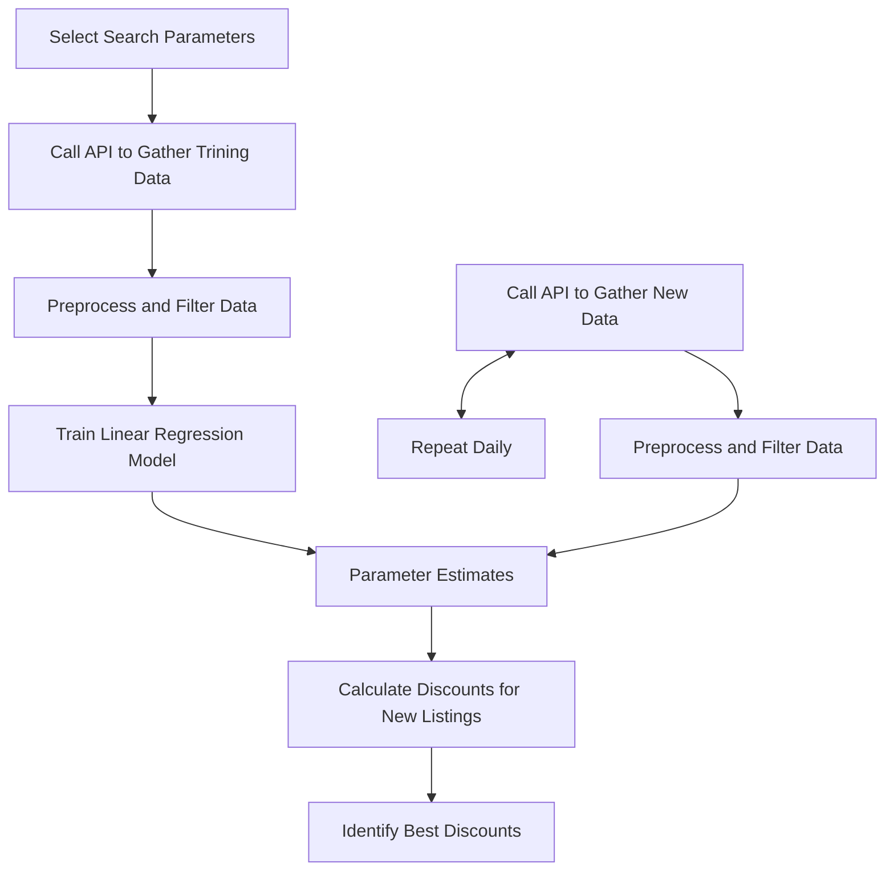

# Used Car Pricer

## Author
Max Melnikas  
[https://mmel099.github.io/](https://mmel099.github.io/)

## Summary
This project was created to assist me in finding a new (used) vehicle. What started as a simple exercise to work with API requests turned into an automated pipeline of data processes that come together to deliver a nifty tool. This project has resulted in an automated tool that gathers new API data daily and identifies cars with discounts. Here are the steps I took to achieve this goal:

  1. Generate a big (~1k) dataset of Toyota Camrys
  2. Select relevant features: mileage, trim, model year
  3. Preprocess data
  4. Train a linear regression using price as the outcome of interest to identify parameter coefficients
  5. Access the latest car listings and evaluate their prices relative to the model
  6. Automate step 5 to execute daily
  7. Generate summaries of high-discount cars

## Description

The [AutoDev API](https://www.auto.dev/listings) was accessed to gather the data necessary to train the model. Toyota Camrys were used for this project due to their popularity and desirability. Cars produced before 2015 were not included. There were no mileage parameters, meaning new cars were included for this component. Additionally, a radius of 150 miles around Boston was imposed for this search. Most (~85%) Camrys that fit this criteria fell into one of four trims: LE, SE, XLE, XSE. These four were the only ones considered. 

In the regression model, trim was expanded into dummy (indicator) variables for each trim. Mileage was included as a simple linear effect. Year was incorporated in a complex way: after converting model year into 'how old' each car was, a log transform was applied. The rationale behind this decision came from the logic that a change from 'year 1' to 'year 2' should be more significant than 'year 6' to 'year 7'. Furthermore, each year was granted its own dummy (indicator) variable as well. This added flexibility was introduced to qualify how the data deviates from the assumed log year term. The final model was selected using likelihood ratio tests. 

The previous steps (1, 2, 3, and 4) were all completed in the jupyter notebook 'cars.ipynb'. For step 5, the 'daily_newsletter.py' and 'helper_functions.py' files were generated. With each run of 'daily_newsletter.py', a new API call is made for a smaller more personalized parameter list of cars. Each car is then sent through the regression model that produces an estimated price of the car. Comparison of this price with the actual price of the vehicle leads to discount price. This data is saved in a temporary file 'newest_data.csv'. Furthermore, there is a file 'master_data.csv' that aggregates the entire history of 'newest_data.csv' files. Finally, there is one last file called 'daily_stats.csv' which tracks number of listings and average discount for each day.

The automation step of this project was a bit tricky but was accomplished with GitHub Actions and YAML. By setting up the YAML file, I enabled a trigger for 'daily_newsletter.py' to run every day at midnight. This script allows GitHub to run my newsletter on its own and publish results to the csv files of this github repository. The next step will be to generate daily, weekly and monthly tables highlighting the highest-discount cars once I have enough data to do so. The final step will be to figure out a better way of sharing this with the world! More to come on that!

